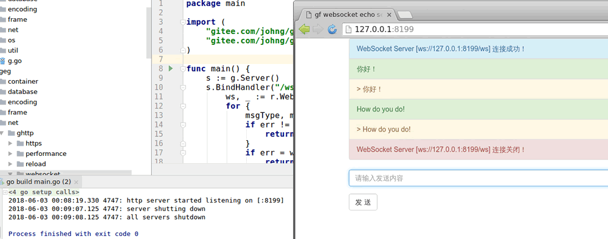

使用gf框架进行WebSocket Server开发相当easy！我们来看一个简单的例子，使用WebSocket Server来开发一个echo服务端（回显服务端），客户端使用HTML5实现。示例代码：[geg/net/ghttp/websocket/echo](https://gitee.com/johng/gf/tree/master/geg/net/ghttp/websocket/echo)

## HTML5客户端
先上H5客户端的代码
```html
<!DOCTYPE html>
<html>
<head>
    <title>gf websocket echo server</title>
    <link rel="stylesheet" href="//cdn.bootcss.com/bootstrap/3.3.5/css/bootstrap.min.css">
    <script src="//cdn.bootcss.com/jquery/1.11.3/jquery.min.js"></script>
</head>
<body>
<div class="container">
    <div class="list-group" id="divShow"></div>
    <div>
        <div><input class="form-control" id="txtContent" autofocus rows="6" placeholder="请输入发送内容"></div>
        <div><button class="btn btn-default" id="btnSend" style="margin-top:15px">发 送</button></div>
    </div>
</div>
</body>
</html>

<script type="application/javascript">
    // 显示提示信息
    function showInfo(content) {
        $("<div class=\"list-group-item list-group-item-info\">" + content + "</div>").appendTo("#divShow")
    }
    // 显示警告信息
    function showWaring(content) {
        $("<div class=\"list-group-item list-group-item-warning\">" + content + "</div>").appendTo("#divShow")
    }
    // 显示成功信息
    function showSuccess(content) {
        $("<div class=\"list-group-item list-group-item-success\">" + content + "</div>").appendTo("#divShow")
    }
    // 显示错误信息
    function showError(content) {
        $("<div class=\"list-group-item list-group-item-danger\">" + content + "</div>").appendTo("#divShow")
    }

    $(function () {
        var url = "ws://127.0.0.1:8199/ws";
        var ws  = new WebSocket(url);
        try {
            // ws连接成功
            ws.onopen = function () {
                showInfo("WebSocket Server [" + url +"] 连接成功！");
            };
            // ws连接关闭
            ws.onclose = function () {
                if (ws) {
                    ws.close();
                    ws = null;
                }
                showError("WebSocket Server [" + url +"] 连接关闭！");
            };
            // ws连接错误
            ws.onerror = function () {
                if (ws) {
                    ws.close();
                    ws = null;
                }
                showError("WebSocket Server [" + url +"] 连接关闭！");
            };
            // ws数据返回处理
            ws.onmessage = function (result) {
                showWaring(" > " + result.data);
            };
        } catch (e) {
            alert(e.message);
        }

        // 按钮点击发送数据
        $("#btnSend").on("click", function () {
            if (ws == null) {
                showError("WebSocket Server [" + url +"] 连接失败，请F5刷新页面!");
                return;
            }
            var content = $.trim($("#txtContent").val()).replace("/[\n]/g", "");
            if (content.length <= 0) {
                alert("请输入发送内容!");
                return;
            }
            $("#txtContent").val("")
            showSuccess(content);
            ws.send(content);
        });

        // 回车按钮触发发送点击事件
        $("#txtContent").on("keydown", function (event) {
            if (event.keyCode == 13) {
                $("#btnSend").trigger("click");
            }
        });
    })

</script>
```

客户端的功能很简单，会将连接状态信息、发送及回显信息显示在界面上。


## WebSocket服务端

```go
package main

import (
    "gitee.com/johng/gf/g"
    "gitee.com/johng/gf/g/net/ghttp"
)

func main() {
    s := g.Server()
    s.BindHandler("/ws", func(r *ghttp.Request) {
        ws, _ := r.WebSocket()
        for {
            msgType, msg, err := ws.ReadMessage()
            if err != nil {
                return
            }
            if err = ws.WriteMessage(msgType, msg); err != nil {
                return
            }
        }
    })
    s.SetPort(8199)
    s.Run()
}
```
服务端的代码相当简单，这里需要着重说明的是3个地方：
1. **WebSocket方法**
	Web Socket服务端的监听和普通的回调函数注册方法一样，但是在接口处理中我们需要通过```ghttp.Request.WebSocket```方法（这里直接使用指针对象```r.WebSocket()```）将请求转换为WebSocket操作，并返回一个```WebSocket对象```，该对象用户后续的通信操作。当然，如果客户端请求并非为WebSocket操作时，转换将会失败，该方法会返回错误信息，使用时请注意判断方法的error返回值。
1. **ReadMessage&WriteMessage**
	读取消息以及写入消息对应的是WebSocket的数据读取以及写入操作，需要注意的是这两个方法都有一个```msgType```的变量，表示请求读取以及写入数据的类型，常见的两种数据类型为：字符串数据或者二进制数据。在使用过程中，由于接口双方都会约定统一的数据格式，因此读取和写入的```msgType```几乎都是一致的，因此在示例中的返回消息时，数据类型参数直接使用的是读取到的```msgType```。

## 示例结果展示

我们首先执行示例代码```main.go```，随后访问页面，随意输入请求内容并提交，随后在服务端关闭程序。可以看到，页面会回显提交的内容信息，并且即时展示WebSocket的连接状态的改变，当服务端关闭时，客户端也会打印出关闭信息。




