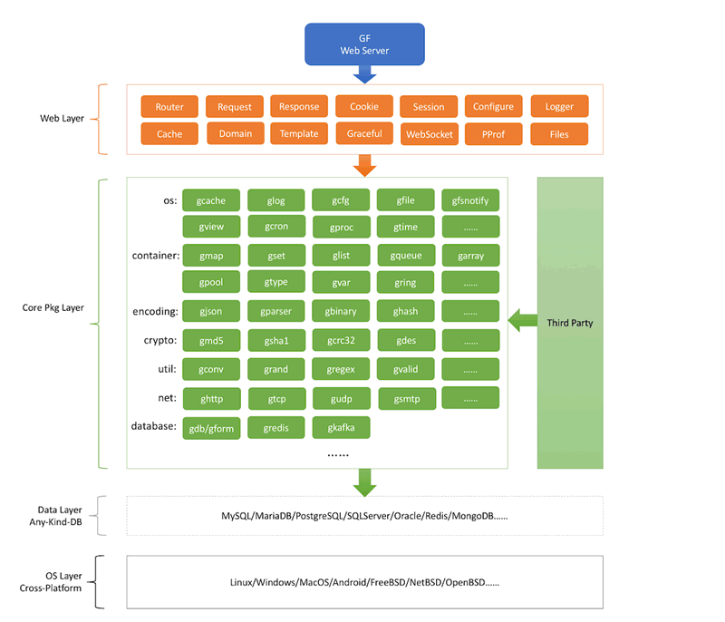

<div align=center>


[](https://godoc.org/github.com/johng-cn/gf) 
[](https://travis-ci.org/johng-cn/gf) 
[](https://goreportcard.com/report/github.com/johng-cn/gf) 
[](https://gfer.me) 
[](https://github.com/johng-cn/gf)
[](https://github.com/johng-cn/gf)
[](https://github.com/johng-cn/gf/releases)
</div>

`GF(Go Frame)`是一款模块化、松耦合、轻量级、高性能的Go应用开发框架。支持热重启、热更新、多域名、多端口、多服务、HTTP/HTTPS、动态路由等特性 ，并提供了Web服务开发的系列核心组件，如：Router、Cookie、Session、服务注册、配置管理、模板引擎、数据校验、分页管理、数据库ORM等等等等， 并且提供了数十个内置核心开发模块集，如：缓存、日志、时间、命令行、二进制、文件锁、内存锁、对象池、连接池、数据编码、进程管理、进程通信、文件监控、定时任务、TCP/UDP组件、 并发安全容器等等等等等等。


# 安装
```html
go get -u gitee.com/johng/gf
```
或者
`go.mod`
```
require gitee.com/johng/gf latest
```
# 限制
```html
golang版本 >= 1.9.2
```

# 架构
<div align=center>

</div>

# 特点
1. 轻量级、高性能，模块化、松耦合设计，丰富的开发模块；
1. 热重启、热更新特性，并支持Web界面及命令行管理接口；
1. 专业的技术交流群，完善的开发文档及示例代码，良好的中文化支持；
1. 支持多种形式的服务注册特性，强大灵活高效的路由控制管理；
1. 支持服务事件回调注册功能，可供选择的`pprof`性能分析模块；
1. 支持配置文件及模板文件的自动检测更新机制，即修改即生效；
1. 支持自定义日期时间格式的时间模块，类似`PHP日期时间格式化`；
1. 强大的数据/表单校验模块，支持常用的40种及自定义校验规则；
1. 强大的网络通信`TCP/UDP`组件，并提供TCP连接池特性，简便高效；
1. 提供了对基本数据类型的并发安全封装，提供了常用的数据结构容器；
1. 支持`Go变量/Json/Xml/Yml/Toml`任意数据格式之间的相互转换及创建；
1. 强大的数据库`ORM`，支持应用层级的集群管理、读写分离、负载均衡，查询缓存、方法及链式ORM操作；
12. 更多特点请查阅框架手册和源码；

`gf`是开源的，免费的，基于`MIT`协议进行分发，开源项目地址：
- **Gitee**( https://gitee.com/johng/gf )
- **Github**( https://github.com/johng-cn/gf )

使用中有任何问题/建议，欢迎加入技术QQ群交流：`116707870`。如有优秀的gf框架使用案例，欢迎联系作者将地址展示到项目库中，您的牛逼将被世人所瞻仰。


<b>当前文档版本 v1.3.8</b>

# 贡献者

<a href="https://gitee.com/johng" target="_blank" title="John"></a>
<a href="https://gitee.com/wenzi1" target="_blank" title="蚊子"></a>

<a href="https://gitee.com/zseeker" target="_blank" title="zseeker"></a>

<a href="https://gitee.com/ymrjqyy" target="_blank" title="一墨染尽青衣颜"></a>

<a href="https://github.com/chenyang351" target="_blank" title="chenyang351"></a>

<a href="https://gitee.com/wxkj" target="_blank" title="wxkj"></a>

<a href="https://github.com/wxkj001" target="_blank" title="3wxkj001
"></a>

<a href="https://gitee.com/zhangjinfu" target="_blank" title="张金富"></a>

<a href="https://gitee.com/garfieldkwong" target="_blank" title="GarfieldKwong"></a>


