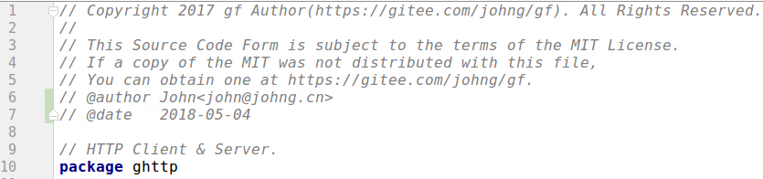
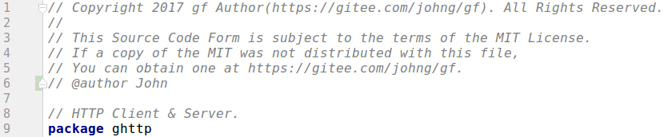
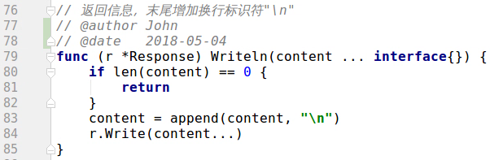
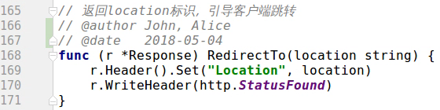

gf是开源的、免费的软件，这意味着任何人都可以为其开发和进步贡献力量。gf的项目源代码目前同时托管在 Gitee 和 Github 平台上，您可以选择您喜欢的平台来 fork 项目和合并你的贡献，两个平台的仓库将会保持即时的同步。我们非常欢迎有更多的朋友加入到gf框架的开发中来，您为gf所做出的任何贡献都将会被记录到gf的史册中。

## 如何贡献代码？

1. 首先fork一份gf的代码到自己的版本库中；
2. 在自己的版本库中新建开发分支并对代码做修改，随后提交修改到自己的版本库；
3. 在自己的版本库中创建一个**pull request**，源分支选择自己的开发分支，目标分支选择主库的master分支；
4. 提交pull request请求，随后等待由项目的开发作者对提交内容做审核，审核通过之后您将成为gf框架的成员之一；
5. 恭喜您，您的名字将永久地载入到gf框架源代码的贡献列表中；

## 团队协作约定

1. 所有源码文件、变量、类型、方法都必须要有详尽的注释，逻辑复杂的地方需要阐述实现思路；
1. 如果源码文件是您新建的，请在文件头加上```@author```标签，并写上您的名称（可选择性地填写上您的邮箱地址），此外```@date```标签是一个建议性标签，用以标识文件创建/更新日期，如下示例：
	
    也可以简写成
    

1. 如果您是在已有源码文件中进行修改，您需要在自己定义的变量、方法、类型的注释中使用```@author```标签写上自己的名称（当您对源码文件修改较大时，您可以直接将您的名称添加到源码文件的```@author```标签中即可，文件中其他地方可以不再赘加），如下示例：
	
3. 当多人协作修改同一文件/方法时，您可以将自己的名称添加到```@author```标签已有作者的名称之后，如下示例：
	
1. 请尊重开源精神、开源协议及他们劳动成果，也便于项目长期维护，不随意改协议、注释内容、@author标签；
