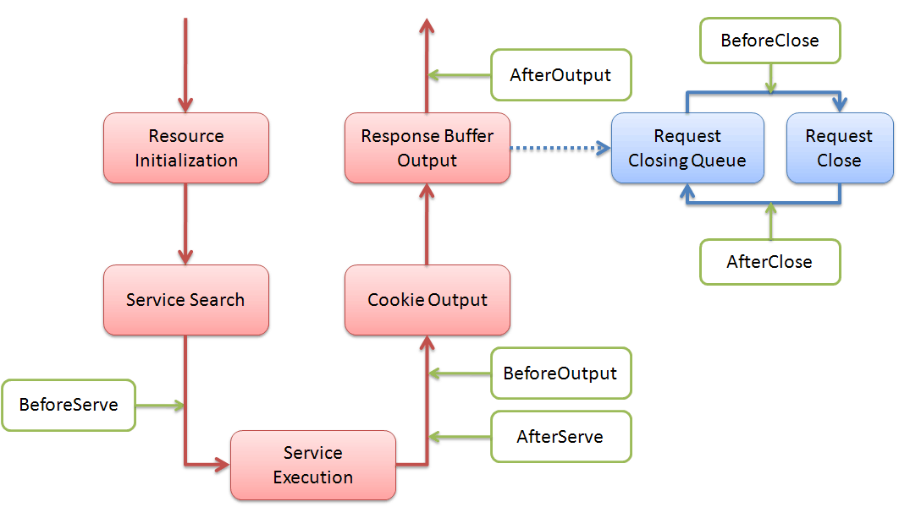
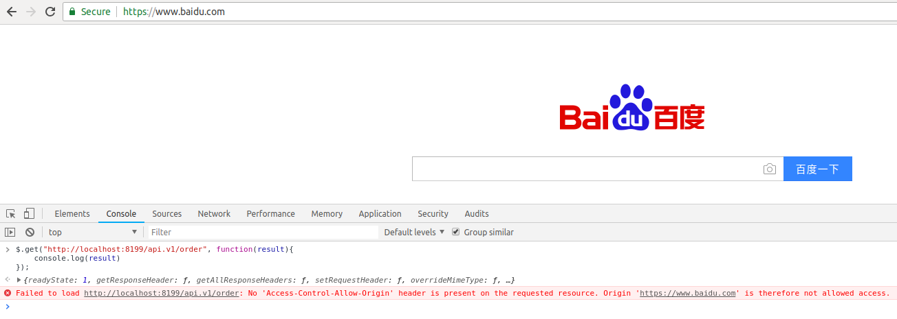
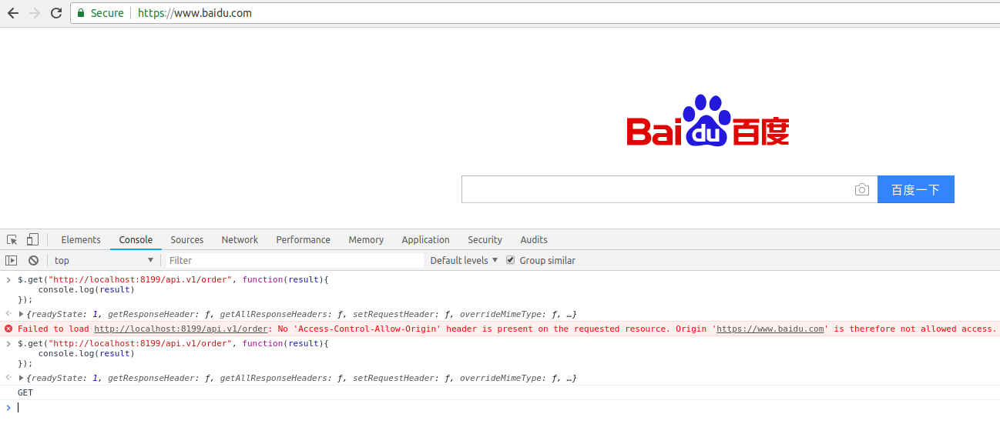

[TOC]

>[danger] # 事件回调注册



```ghttp.Server```提供了事件回调注册功能，类似于其他框架所谓的```中间件```功能，支持用户对于某一事件进行自定义监听处理，按照```pattern```方式进行绑定注册(```pattern```格式与服务注册一致)。支持多个方法对同一事件进行监听，```ghttp.Server```将会按照注册顺序进行回调方法调用。
相关方法如下：
```go
func (s *Server) BindHookHandler(pattern string, hook string, handler HandlerFunc) error
func (s *Server) BindHookHandlerByMap(pattern string, hookmap map[string]HandlerFunc) error
```
当然域名对象也支持事件回调注册：
```go
func (d *Domain) BindHookHandler(pattern string, hook string, handler HandlerFunc) error
func (d *Domain) BindHookHandlerByMap(pattern string, hookmap map[string]HandlerFunc) error
```
支持的Hook事件列表：
1. ```BeforeServe```
	在进入/初始化服务对象之前。
1. ```AfterServe```
	在完成服务执行流程之后。
1. ```BeforeOutput```
	向客户端输出返回内容之前。
1. ```AfterOutput```
	向客户端输出返回内容之后。
1. ```BeforeClose```
	在http请求关闭之前（注意请求关闭是异步处理操作，没有在http执行流程中处理）。
1. ```AfterClose```
	在http请求关闭之后（注意请求关闭是异步处理操作，没有在http执行流程中处理）。

具体调用时机请参考图例所示。

## 事件优先级

由于事件的绑定也是使用的路由规则，因此它的优先级和【[路由控制](路由控制.md)】章节介绍的优先级是一样的。

但是事件调用时和服务注册调用时的机制不一样，同一个路由规则下允许绑定多个事件回调方法，该路由下的事件调用会按照优先级进行调用，假如优先级相等的路由规则，将会按照事件注册的顺序进行调用。


## 使用示例1，基本使用
```go
package main

import (
    "gitee.com/johng/gf/g"
    "gitee.com/johng/gf/g/os/glog"
    "gitee.com/johng/gf/g/net/ghttp"
)

func main() {
    // 基本事件回调使用
    p := "/:name/info/{uid}"
    s := g.Server()
    s.BindHookHandlerByMap(p, map[string]ghttp.HandlerFunc{
        "BeforeServe"  : func(r *ghttp.Request){ glog.Println("BeforeServe") },
        "AfterServe"   : func(r *ghttp.Request){ glog.Println("AfterServe") },
        "BeforeOutput" : func(r *ghttp.Request){ glog.Println("BeforeOutput") },
        "AfterOutput"  : func(r *ghttp.Request){ glog.Println("AfterOutput") },
        "BeforeClose"  : func(r *ghttp.Request){ glog.Println("BeforeClose") },
        "AfterClose"   : func(r *ghttp.Request){ glog.Println("AfterClose") },
    })
    s.BindHandler(p, func(r *ghttp.Request) {
       r.Response.Write("用户:", r.Get("name"), ", uid:", r.Get("uid"))
    })
    s.SetPort(8199)
    s.Run()
}
```
当访问```http://127.0.0.1:8199/john/info/10000```时，运行Web Server进程的终端将会按照事件的执行流程打印出对应的事件名称。

## 使用示例2，改变业务逻辑
```go
package main

import (
    "fmt"
    "gitee.com/johng/gf/g"
    "gitee.com/johng/gf/g/net/ghttp"
)

func main() {
    s := g.Server()

    // 多事件回调示例，事件1
    pattern1 := "/:name/info"
    s.BindHookHandlerByMap(pattern1, map[string]ghttp.HandlerFunc {
        "BeforeServe"  : func(r *ghttp.Request) {
            r.SetQuery("uid", "1000")
        },
    })
    s.BindHandler(pattern1, func(r *ghttp.Request) {
        r.Response.Write("用户:", r.Get("name"), ", uid:", r.GetQueryString("uid"))
    })

    // 多事件回调示例，事件2
    pattern2 := "/{object}/list/{page}.java"
    s.BindHookHandlerByMap(pattern2, map[string]ghttp.HandlerFunc {
        "BeforeOutput" : func(r *ghttp.Request){
            r.Response.SetBuffer([]byte(
                fmt.Sprintf("通过事件修改输出内容, object:%s, page:%s", r.Get("object"), r.GetRouterString("page"))),
            )
        },
    })
    s.BindHandler(pattern2, func(r *ghttp.Request) {
        r.Response.Write(r.Router.Uri)
    })
    s.SetPort(8199)
    s.Run()
}
```

通过事件1设置了访问```/:name/info```路由规则时的GET参数；通过事件2，改变了当访问的路径匹配路由```/{object}/list/{page}.java```时的输出结果。

## 使用示例3，事件回调注册优先级
```go
package main

import (
    "gitee.com/johng/gf/g"
    "gitee.com/johng/gf/g/net/ghttp"
    "gitee.com/johng/gf/g/os/glog"
)

func main() {
    s := g.Server()
    s.BindHandler("/priority/show", func(r *ghttp.Request) {
        r.Response.Write("priority test")
    })

    s.BindHookHandlerByMap("/priority/:name", map[string]ghttp.HandlerFunc {
        "BeforeServe"  : func(r *ghttp.Request) {
            glog.Println(r.Router.Uri)
        },
    })
    s.BindHookHandlerByMap("/priority/*any", map[string]ghttp.HandlerFunc {
        "BeforeServe"  : func(r *ghttp.Request) {
            glog.Println(r.Router.Uri)
        },
    })
    s.BindHookHandlerByMap("/priority/show", map[string]ghttp.HandlerFunc {
        "BeforeServe"  : func(r *ghttp.Request) {
            glog.Println(r.Router.Uri)
        },
    })
    s.SetPort(8199)
    s.Run()
}
```
在这个示例中，我们往注册了3个路由规则的事件回调，并且都匹配服务注册的地址```/priority/show```，这样我们便可以通过访问这个地址来看看路由执行的顺序是怎么样的。

执行后我们访问```http://127.0.0.1:8199/priority/show```，随后我们可以在服务端的终端上看到以下输出信息：
```html
2018-08-03 15:16:25.971 27391: http server started listening on [:8199]
2018-08-03 15:16:28.385 /priority/show
2018-08-03 15:16:28.385 /priority/:name
2018-08-03 15:16:28.385 /priority/*any
```

## 使用示例4，使用事件回调处理跨域请求
首先我们来看一个简单的REST接口示例：
```go
package main

import (
    "gitee.com/johng/gf/g"
    "gitee.com/johng/gf/g/frame/gmvc"
    "gitee.com/johng/gf/g/net/ghttp"
)

type Order struct {
    gmvc.Controller
}

func (o *Order) Get() {
    o.Response.Write("GET")
}

func main() {
    s := g.Server()
    s.BindControllerRest("/api.v1/{.struct}", new(Order))
    s.SetPort(8199)
    s.Run()
}
```
接口地址是```http://localhost/api.v1/order```，当然这个接口是不允许跨域的。我们打开一个不同的域名，例如：百度首页，然后按```F12```打开开发者面板，在```console```下执行以下AJAX请求：
```javascript
$.get("http://localhost:8199/api.v1/order", function(result){
    console.log(result)
});
```
结果如下：

返回了不允许跨域的错误，接着我们修改一下测试代码，如下：

```go
package main

import (
    "gitee.com/johng/gf/g"
    "gitee.com/johng/gf/g/frame/gmvc"
    "gitee.com/johng/gf/g/net/ghttp"
)

type Order struct {
    gmvc.Controller
}

func (o *Order) Get() {
    o.Response.Write("GET")
}

func main() {
    s := g.Server()
    s.BindHookHandlerByMap("/api.v1/*any", map[string]ghttp.HandlerFunc {
       "BeforeServe"  : func(r *ghttp.Request) {
           r.Response.SetAllowCrossDomainRequest("*", "PUT,GET,POST,DELETE,OPTIONS")
       },
    })
    s.BindControllerRest("/api.v1/{.struct}", new(Order))
    s.SetPort(8199)
    s.Run()
}
```
我们增加了针对于路由```/api.v1/*any```的绑定事件```BeforeServe```，该事件将会在所有服务执行之前调用，该事件的回调方法中，我们通过调用```SetAllowCrossDomainRequest```方法设置运行跨域请求。该绑定的事件路由规则使用了模糊匹配规则，表示所有```/api.v1```开头的接口地址都允许跨域请求。

返回刚才的百度首页，再次执行请求AJAX请求，这次便成功了：

