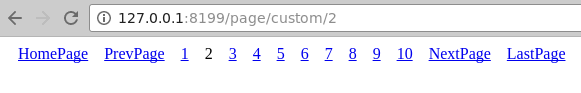

由于分页对象预定义的样式比较有限，有的时候我们想自定义分页的样式（标签输出），不过分页对象的的所有方法都是公开的，这便为开发者自定义分页样式提供了非常高的灵活度。开发者可以通过以下方式实现自定义分页内容：
1. 根据公开的方法自行组织分页样式；
2. 对输出内容进程正则匹配替换实现自定义；
3. 也可以自定义一个分页对象（继承于原有分页对象），使用方法重载的方式来实现自定义；

我们以下示例中采用第一种简单的方式来实现自定义：
```go
package main

import (
    "gitee.com/johng/gf/g/os/gview"
    "gitee.com/johng/gf/g/net/ghttp"
    "gitee.com/johng/gf/g/util/gpage"
)

// 自定义分页内容
func pageContent(page *gpage.Page) string {
    page.NextPageTag  = "NextPage"
    page.PrevPageTag  = "PrevPage"
    page.FirstPageTag = "HomePage"
    page.LastPageTag  = "LastPage"
    pageStr := page.FirstPage()
    pageStr += page.PrevPage()
    pageStr += page.PageBar("current-page")
    pageStr += page.NextPage()
    pageStr += page.LastPage()
    return pageStr
}

func main() {
    s := ghttp.GetServer()
    s.BindHandler("/page/custom/*page", func(r *ghttp.Request) {
        page      := gpage.New(100, 10, r.Get("page"), r.URL.String(), r.Router.Uri)
        buffer, _ := gview.ParseContent(`
        <html>
            <head>
                <style>
                    a,span {padding:8px; font-size:16px;}
                    div{margin:5px 5px 20px 5px}
                </style>
            </head>
            <body>
                <div>{{.page}}</div>
            </body>
        </html>
        `, g.Map{
            "page" : gview.HTML(pageContent(page)),
        })
        r.Response.Write(buffer)
    })
    s.SetPort(8199)
    s.Run()
}
```

执行后，页面输出结果为：
