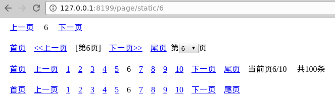

静态分页是指页面的分页参数使用的是路由传参，这种场景下分页对象与Web Server的路由设计耦合性比较大。

示例如下：
```go
package main

import (
    "gitee.com/johng/gf/g"
    "gitee.com/johng/gf/g/os/gview"
    "gitee.com/johng/gf/g/net/ghttp"
    "gitee.com/johng/gf/g/util/gpage"
)

func main() {
    s := ghttp.GetServer()
    s.BindHandler("/page/static/*page", func(r *ghttp.Request){
        page := gpage.New(100, 10, r.Get("page"), r.URL.String(), r.Router.Uri)
        buffer, _ := gview.ParseContent(`
        <html>
            <head>
                <style>
                    a,span {padding:8px; font-size:16px;}
                    div{margin:5px 5px 20px 5px}
                </style>
            </head>
            <body>
                <div>{{.page1}}</div>
                <div>{{.page2}}</div>
                <div>{{.page3}}</div>
                <div>{{.page4}}</div>
            </body>
        </html>
        `, g.Map{
            "page1" : g.HTML(page.GetContent(1)),
            "page2" : g.HTML(page.GetContent(2)),
            "page3" : g.HTML(page.GetContent(3)),
            "page4" : g.HTML(page.GetContent(4)),
        })
        r.Response.Write(buffer)
    })
    s.SetPort(8199)
    s.Run()
}
```

在该示例中，我们需要用到分页对象```New```方法的第五个参数，```route...string```，该参数是当前请求的路由规则。我们这里可以通过```r.Router.Uri```方式将路由规则传递给分页对象。其中，```ghttp.Request.Router```是与当前请求匹配的路由对象，包含路由规则等相关信息，在分页对象中处理分页参数时，我们只会用到Uri属性。

执行后，我们手动访问```http://127.0.0.1:8199/page/static/6```页面的结果如下：

