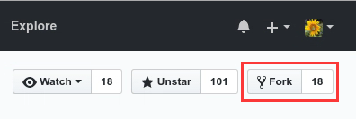
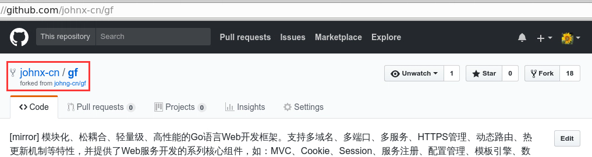
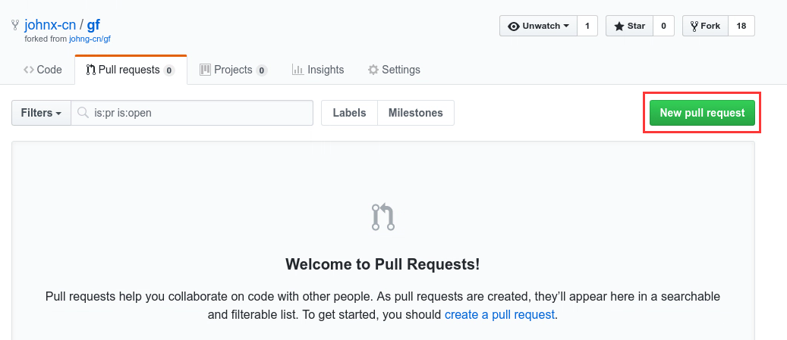
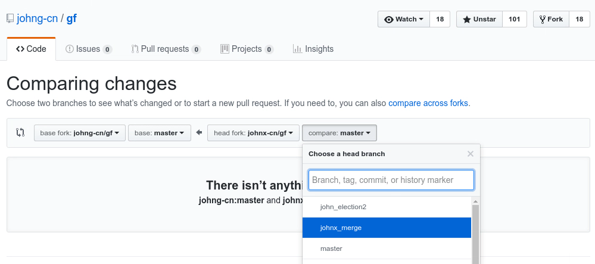
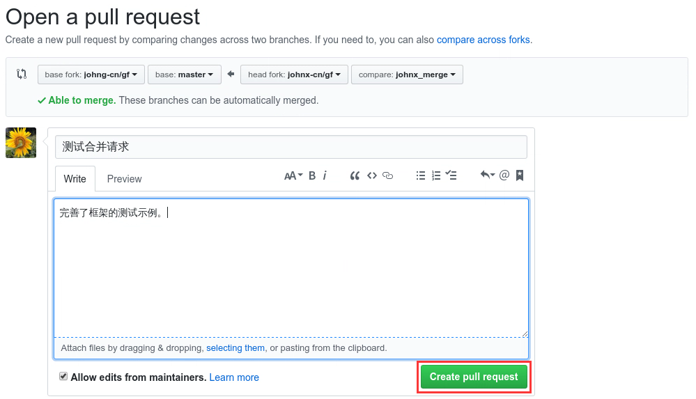
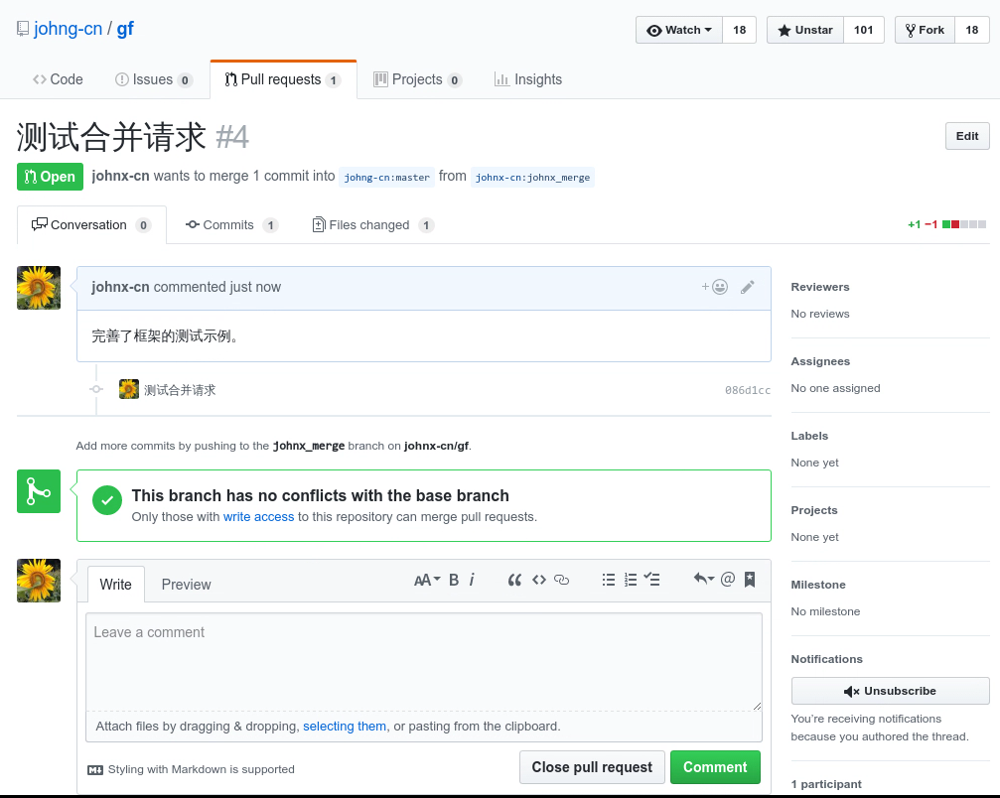
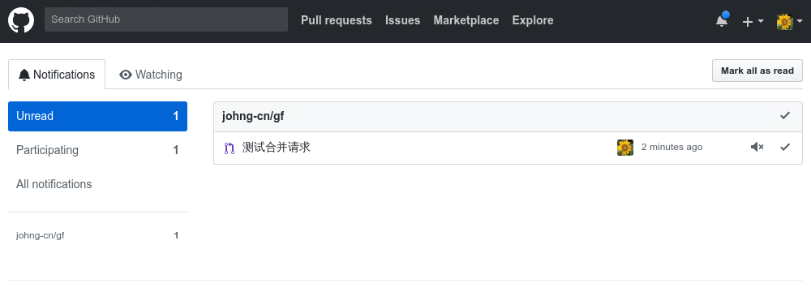
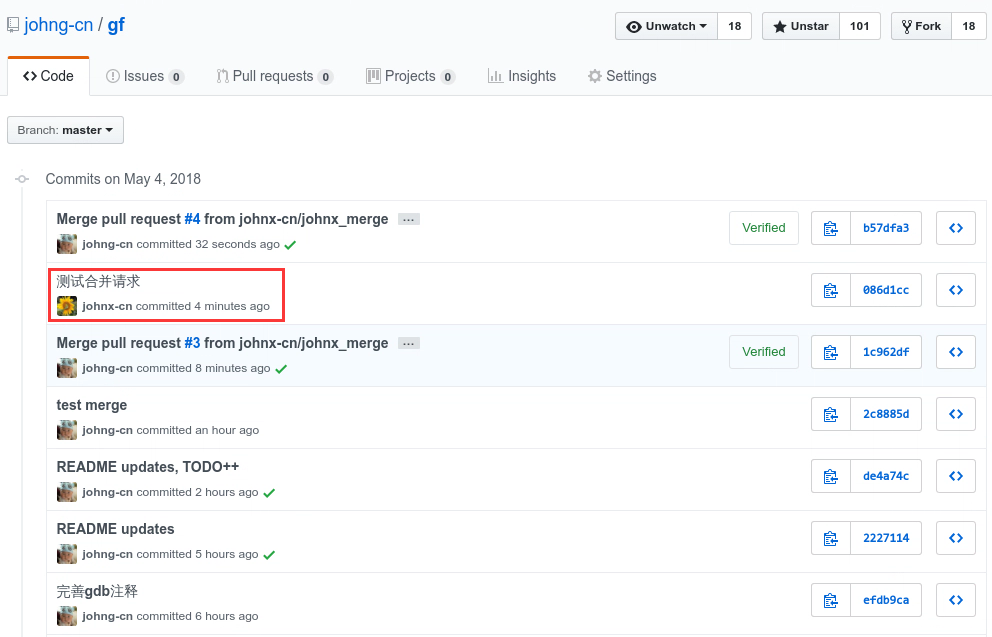

gf是开源的、免费的软件，这意味着任何人都可以为其开发和进步贡献力量。gf的项目源代码目前同时托管在 Gitee 和 Github 平台上，您可以选择您喜欢的平台来 fork 项目和合并你的贡献，两个平台的仓库将会保持即时的同步。我们非常欢迎有更多的朋友加入到gf框架的开发中来，您为gf所做出的任何贡献都将会被记录到gf的史册中。

## 如何贡献代码？

1. 首先fork一份gf的代码到自己的版本库中；
2. 在自己的版本库中新建开发分支并对代码做修改，随后提交修改到自己的版本库；
3. 在自己的版本库中创建一个**pull request**，源分支选择自己的开发分支，目标分支选择主库的master分支；
4. 提交pull request请求，随后等待由项目的开发作者对提交内容做审核，审核通过之后您将成为gf框架的成员之一；
5. 恭喜您，您的名字将永久地载入到gf框架源代码的贡献列表中；


## 简易图文教程

以下图文教程以github仓库来介绍如何贡献代码到框架主仓库中（gitee仓库同理），我们这里使用了一个新用户```johnx-cn```来执行以下贡献操作流程。

1. **首先，fork目标仓库到自己的项目库中**
	* 点击项目仓库右上角的```Fork```按钮即可
	
    * 成功之后会在您的项目库中生成一个fork项目（仓库地址为```https://github.com/johnx-cn/gf```），如下所示：
    
    
1. **接着，拉取代码、本地修改并提交仓库**
	```git clone```自己版本库的代码到本地，然后**新开分支**并进行一些文件修改：
	```shell
    john@johnhome:~/Workspace$ git clone https://github.com/johnx-cn/gf
    Cloning into 'gf'...
    remote: Counting objects: 10056, done.
    remote: Compressing objects: 100% (234/234), done.
    remote: Total 10056 (delta 140), reused 0 (delta 0)
    Receiving objects: 100% (10056/10056), 65.51 MiB | 1.01 MiB/s, done.
    Resolving deltas: 100% (4939/4939), done.
    Checking connectivity... done.
    
    john@johnhome:~/Workspace$ cd gf
    john@johnhome:~/Workspace/gf$ git branch johnx_merge
    john@johnhome:~/Workspace/gf$ git checkout johnx_merge
    john@johnhome:~/Workspace/gf$ git status
    On branch master
    Your branch is up-to-date with 'origin/master'.

    Changes not staged for commit:
      (use "git add <file>..." to update what will be committed)
      (use "git checkout -- <file>..." to discard changes in working directory)

        modified:   geg/other/test.go

    no changes added to commit (use "git add" and/or "git commit -a")

    john@johnhome:~/Workspace/gf$ git add -A
    john@johnhome:~/Workspace/gf$ git commit -m "测试合并请求"
    john@johnhome:~/Workspace/gf$ git push origin johnx_merge 
    Counting objects: 40, done.
    Delta compression using up to 4 threads.
    Compressing objects: 100% (5/5), done.
    Writing objects: 100% (5/5), 471 bytes | 0 bytes/s, done.
    Total 5 (delta 3), reused 0 (delta 0)
    remote: Resolving deltas: 100% (3/3), completed with 3 local objects.
    To https://github.com/johnx-cn/gf
       de4a74c..2c8885d  johnx_merge -> johnx_merge
    ```
	我们这里新建了一个```johnx_merge```分支，并切换到该分支后，对```test.go```示例文件进行了一些修改，随后提交该分支到自己的版本库中。
    
1. **然后，创建一个代码合并请求**
    * 点击```Pull requests```的tab菜单，随后点击页面右侧的```New pull request```按钮
    
    * 在打开的页面中，左侧选择需要合并的主仓库地址以及对应分支，我们这里固定选择```johng-cn/gf```仓库以及```master```主分支，右侧选择自己需要合并到目标仓库的本地分支（```johnx_merge```）
    

1. **最后，查看修改并提交合并请求**
    * 查看两个仓库不同分支的版本对比情况，这里只有简单的一个文件修改
    	
    * 填写合并请求信息，最后点击```Create pull request```按钮进行提交
        
	* 最后生成一条合并请求信息，然后等待主仓库开发者进行合并处理
    	
    * 合并成功之后您将会收到一条github的站内信提醒
    	
    * 同时，对应的合并请求状态也会发生变化
        
    * 主仓库的提交历史中将会保存并呈现出您对框架的所有贡献记录
    	
    	
1. **恭喜您成为gf框架开发团队的一员！**


