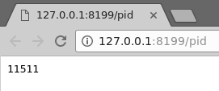
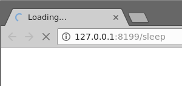
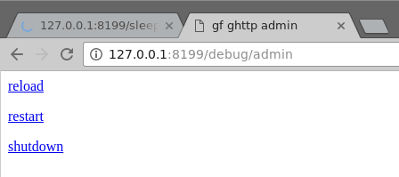
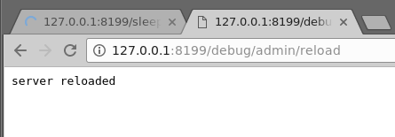
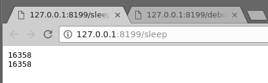

[TOC]


>[danger] # 基本介绍

平滑重启(热重启)是指Web Server在重启的时候不会中断已有请求的执行。该特性在不同的项目版本发布的时候特别有用，例如，当需要先后发布两个版本：A、B，那么在A执行的过程当中，我们可以将B的程序直接发布覆盖A的程序，并使用平滑重启特性无缝地将请求过渡到新版本的服务中。

需要注意的是，该特性仅限于```*nix```系统(Linux/Unix/FreeBSD等等)，在Windows下仅支持完整重启功能(请求无法平滑过渡)。

>[danger] # 管理功能

gf框架支持非常方便的Web管理功能，也就是说我们可以通过Web页面/接口直接进行Web Server的重启/关闭等管理操作。同时，gf框架也支持通过命令行终端指令(仅限```*nix```系统)的形式进行Web Server的重启/关闭等管理操作。


>[success] ## Web管理

我们先来看一下Web Server中涉及到管理操作方法有哪些：
```go
func (s *Server) Reload() error
func (s *Server) Restart() error
func (s *Server) Shutdown() error

func (s *Server) EnableAdmin(pattern ...string)
```
其中，```Reload```用于平滑重启，```Restart```用于完整重启，```Shutdown```用于关闭Web Server。我们可以随时在注册的服务处理接口中调用这3个方法来实现Web Server的管理操作。

此外，gf框架提供了一个简便的管理方法```EnableAdmin```，用于将管理页面注册到指定的路由规则上，默认地址是```/debug/admin```。

### 示例1：基本使用
```go
package main

import (
    "time"
    "gitee.com/johng/gf/g"
    "gitee.com/johng/gf/g/os/gproc"
    "gitee.com/johng/gf/g/net/ghttp"
)

func main() {
    s := g.Server()
    s.BindHandler("/", func(r *ghttp.Request){
        r.Response.Writeln("哈喽！")
    })
    s.BindHandler("/pid", func(r *ghttp.Request){
        r.Response.Writeln(gproc.Pid())
    })
    s.BindHandler("/sleep", func(r *ghttp.Request){
        r.Response.Writeln(gproc.Pid())
        time.Sleep(10*time.Second)
        r.Response.Writeln(gproc.Pid())
    })
    s.EnableAdmin()
    s.SetPort(8199)
    s.Run()
}
```
我们通过以下几个步骤来测试平滑重启：
1. 访问 http://127.0.0.1:8199/pid 查看当前进程的pid
	
3. 访问 http://127.0.0.1:8199/sleep ，这个页面将会执行10秒，用于测试重启时该页面请求执行是否会断掉
	
5. 访问 http://127.0.0.1:8199/debug/admin ，这是```s.EnableAdmin```后默认注册的一个Web Server管理页面
	
7. 随后我们点击```reload```管理链接，Web Server将会立即平滑重启
	
    同时在终端也会输出以下信息:
    ```shell
    2018-05-18 11:02:04.812 11511: http server started listening on [:8199]
    2018-05-18 11:02:09.172 11511: server reloading
    2018-05-18 11:02:09.176 16358: http server reloaded listening on [:8199]
    ```
6. 我们可以发现在整个操作中，```sleep```页面的执行并没有被中断，继续等待几秒，当```sleep```执行完成后，页面输出内容为：
	
8. 可以发现，```sleep```页面输出的进程pid和之前的不一样了，代表请求的执行被新的进程平滑接管，旧的服务进程也随之销毁；

### 示例2：HTTPS支持

```go
package main

import (
    "gitee.com/johng/gf/g"
    "gitee.com/johng/gf/g/net/ghttp"
)

func main() {
    s := g.Server()
    s.BindHandler("/", func(r *ghttp.Request){
        r.Response.Writeln("哈罗！")
    })
    s.EnableHTTPS("/home/john/temp/server.crt", "/home/john/temp/server.key")
    s.EnableAdmin()
    s.SetPort(8200)
    s.Run()
}
```
gf框架的平滑重启特性对于HTTPS的支持也是相当友好和简便，操作步骤如下：
1. 访问 https://127.0.0.1:8200/debug/admin/reload 平滑重启HTTPS服务；
2. 访问 https://127.0.0.1:8200/debug/admin/shutdown 平滑关闭Web Server服务；

在命令行终端可以看到以下输出信息：
```shell
2018-05-18 11:13:05.554 17278: https server started listening on [:8200]
2018-05-18 11:13:21.270 17278: server reloading
2018-05-18 11:13:21.278 17319: https server reloaded listening on [:8200]
2018-05-18 11:13:34.895 17319: server shutting down
2018-05-18 11:13:34.895 17269: all servers shutdown
```
### 示例3：多服务及多端口
gf框架的平滑重启特性相当强大及稳定，不仅仅支持单一服务单一端口监听管理，同时也支持多服务多端口等复杂场景的监听管理。
```go
package main

import (
    "gitee.com/johng/gf/g"
)

func main() {
    s1 := g.Server("s1")
    s1.EnableAdmin()
    s1.SetPort(8100, 8200)
    s1.Start()

    s2 := g.Server("s2")
    s2.EnableAdmin()
    s2.SetPort(8300, 8400)
    s2.Start()

    g.Wait()
}
```
以上示例演示的是两个Web Server ```s1```及```s2```，分别监听```8100```，```8200```及```8300```，```8400```。我们随后访问 http://127.0.0.1:8100/debug/admin/reload 平滑重启服务，然后再通过 http://127.0.0.1:8100/debug/admin/shutdown 平滑关闭服务，最终在终端打印出的信息如下：
```shell
2018-05-18 11:26:54.729 18111: http server started listening on [:8400]
2018-05-18 11:26:54.729 18111: http server started listening on [:8100]
2018-05-18 11:26:54.729 18111: http server started listening on [:8300]
2018-05-18 11:26:54.729 18111: http server started listening on [:8200]
2018-05-18 11:27:08.203 18111: server reloading
2018-05-18 11:27:08.207 18124: http server reloaded listening on [:8300]
2018-05-18 11:27:08.207 18124: http server reloaded listening on [:8400]
2018-05-18 11:27:08.207 18124: http server reloaded listening on [:8200]
2018-05-18 11:27:08.207 18124: http server reloaded listening on [:8100]
2018-05-18 11:27:19.379 18124: server shutting down
2018-05-18 11:27:19.380 18102: all servers shutdown
```

>[success] ## 命令行管理

gf框架除了提供Web方式的管理能力以外，也支持命令行方式来进行管理，由于命令行采用了信号量进行管理，因此仅支持```*nix```系统。

### 主进程与子进程
gf框架的平滑重启特性是依靠多进程及进程间通信来实现的，因此Web Server程序执行后将会存在两个进程，并且有主/子进程之分。假如我们的Web Server程序名称叫做```demo```，执行运行之后，我们通过```ps```命令查看进程情况：
```shell
$ ps aux | grep demo
john     19557  0.1  0.1 282408 10676 ?        Sl   11:53   0:00 /tmp/demo
john     19566  0.0  0.1 356140 10688 ?        Sl   11:53   0:00 /tmp/demo --gproc-child
```
其中，命令行带有```--gproc-child```参数的是子进程，是Web Server真实提供服务的进程，另外一个是主进程，用于对子进程进行状态监控和行为管理。

将这一章节放到最前面的目的，是想要强调以下命令行操作的进程ID都是针对的**主进程ID**。

### 平滑重启
使用```SIGUSR1```信号量实现，使用方式：```kill -SIGUSR1 主进程ID```


### 完整重启
使用```SIGUSR2```信号量实现，使用方式：```kill -SIGUSR2 主进程ID```

### 关闭服务
使用```SIGINT/SIGQUIT/SIGKILL/SIGHUP/SIGTERM```信号量实现，可以使用其中任一一个信号量来关闭服务，使用方式：```kill -SIGTERM 主进程ID```


