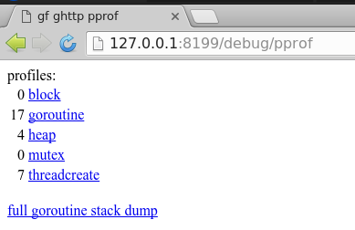
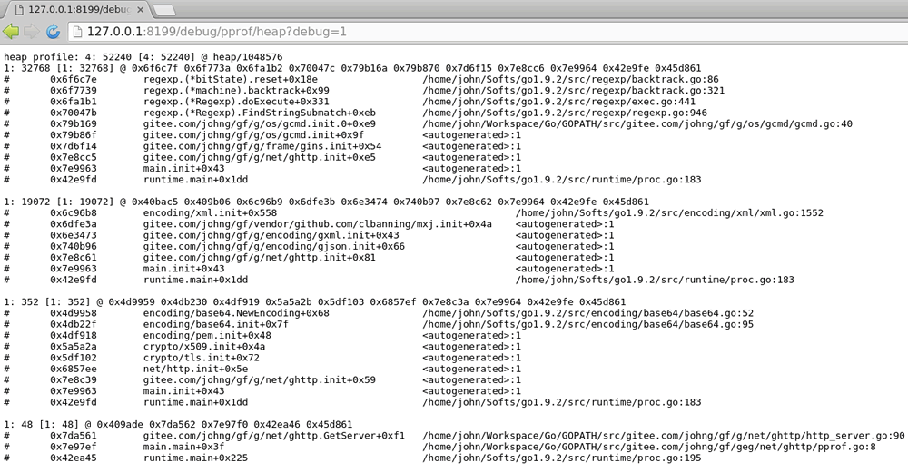
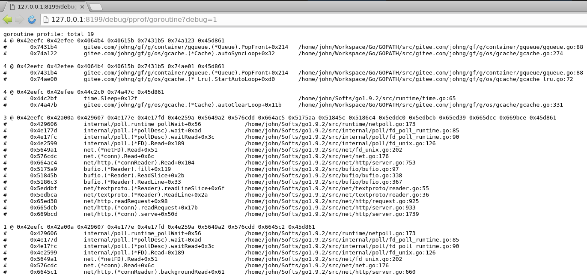
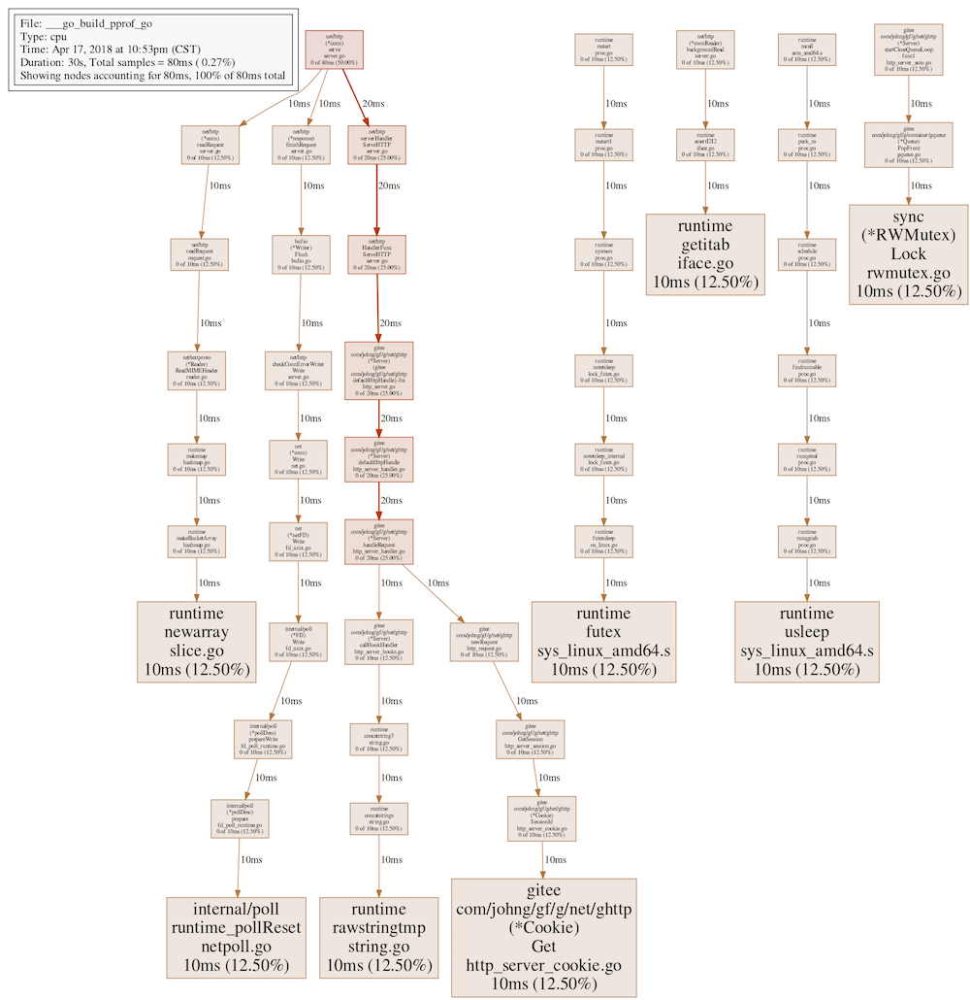

>[danger] # 服务性能分析

ghttp包提供了非常强大和简便的服务性能分析功能，内部完美集成了```pprof```性能分析工具，可以在任何时候通过```EnablePprof```方法启用性能分析特性，并可自定义性能分析工具页面路由地址，不传递路由地址时，默认URI地址为```/debug/pprof```。

我们来看一个简单的例子：
```go
package main

import (
    "gitee.com/johng/gf/g/net/ghttp"
)

func main() {
    s := ghttp.GetServer()
    s.EnablePprof()
    s.BindHandler("/", func(r *ghttp.Request){
        r.Response.Writeln("哈喽世界！")
    })
    s.SetPort(8199)
    s.Run()
}
```
这个例子使用了```s.EnablePprof()```启用了性能分析，默认会自动注册以下几个路由规则：
```html
/debug/pprof/*action
/debug/pprof/cmdline
/debug/pprof/profile
/debug/pprof/symbol
/debug/pprof/trace
```
其中```/debug/pprof/*action```为页面访问的路由，其他几个地址为```go tool pprof```命令准备的。简单的性能分析我们直接访问```/debug/pprof```地址即可，内容如下：
1. pprof页面

1. 堆使用量

1. 当前进程中的goroutine详情


如果想要进行详细的性能分析，基本上离不开```go tool pprof```命令行工具的支持，在开启性能分析支持后，我们可以使用以下命令执行性能采集分析：
```
go tool pprof "http://127.0.0.1:8199/debug/pprof/profile"
```
执行后pprof工具经过约30秒左右的接口信息采集（这30秒期间Web Server应当有流量进入，我们这里不停地访问hello world页面以作测试），然后生成性能分析报告，随后可以通过```top10```/```web```等pprof命令查看报告结果，更多命令可使用```go tool pprof```查看。关于pprof的详细使用介绍，请查看golang官方：[blog.golang.org/profiling-go-programs](https://blog.golang.org/profiling-go-programs)

本示例中的命令行性能分析结果如下：
```shell
john@johnhome:~/Workspace/Go/gf$ go tool pprof "http://127.0.0.1:8199/debug/pprof/profile"
Fetching profile over HTTP from http://127.0.0.1:8199/debug/pprof/profile
Saved profile in /home/john/pprof/pprof.___go_build_pprof_go.samples.cpu.001.pb.gz
File: ___go_build_pprof_go
Type: cpu
Time: Apr 17, 2018 at 10:53pm (CST)
Duration: 30s, Total samples = 80ms ( 0.27%)
Entering interactive mode (type "help" for commands, "o" for options)
(pprof) top10
Showing nodes accounting for 80ms, 100% of 80ms total
Showing top 10 nodes out of 49
      flat  flat%   sum%        cum   cum%
      10ms 12.50% 12.50%       10ms 12.50%  gitee.com/johng/gf/g/net/ghttp.(*Cookie).Get /home/john/Workspace/Go/GOPATH/src/gitee.com/johng/gf/g/net/ghttp/http_server_cookie.go
      10ms 12.50% 25.00%       10ms 12.50%  internal/poll.runtime_pollReset /home/john/Softs/go1.9.2/src/runtime/netpoll.go
      10ms 12.50% 37.50%       10ms 12.50%  runtime.futex /home/john/Softs/go1.9.2/src/runtime/sys_linux_amd64.s
      10ms 12.50% 50.00%       10ms 12.50%  runtime.getitab /home/john/Softs/go1.9.2/src/runtime/iface.go
      10ms 12.50% 62.50%       10ms 12.50%  runtime.newarray /home/john/Softs/go1.9.2/src/runtime/slice.go
      10ms 12.50% 75.00%       10ms 12.50%  runtime.rawstringtmp /home/john/Softs/go1.9.2/src/runtime/string.go
      10ms 12.50% 87.50%       10ms 12.50%  runtime.usleep /home/john/Softs/go1.9.2/src/runtime/sys_linux_amd64.s
      10ms 12.50%   100%       10ms 12.50%  sync.(*RWMutex).Lock /home/john/Softs/go1.9.2/src/sync/rwmutex.go
         0     0%   100%       10ms 12.50%  bufio.(*Writer).Flush /home/john/Softs/go1.9.2/src/bufio/bufio.go
         0     0%   100%       10ms 12.50%  gitee.com/johng/gf/g/container/gqueue.(*Queue).PopFront /home/john/Workspace/Go/GOPATH/src/gitee.com/johng/gf/g/container/gqueue/gqueue.go
(pprof) web
Failed to execute dot. Is Graphviz installed? Error: exec: "dot": executable file not found in $PATH
(pprof) web 
(pprof) 
```
其中web命令用以图形展示接口之间的调用关系以及性能情况，但是需要安装```Graphviz```图形化工具，以我目前的系统为ubuntu为例，直接执行```sudo apt-get install Graphviz```命令即可安装完成图形化工具，随后再次使用web命令，最终生成以下图表：



