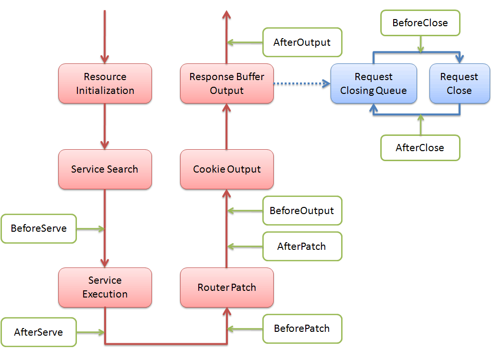

[TOC]


当用户访问某个URI时，Web Server能够精确的调用特定的服务接口提供服务，这些都是通过“服务注册”来实现的。Web Server提供服务需要回调函数/方法/对象/控制器的支持，ghttp包支持多种服务注册模式，为开发者提供非常强大和灵活的接口功能。服务注册是整个Web Server最核心的部分，也是gf框架中最精心设计的一个模块。本章节将会进行详细介绍。

服务注册管理由ghttp包提供，API文档地址：[godoc.org/github.com/johng-cn/gf](https://godoc.org/github.com/johng-cn/gf)。

>[danger] # 服务注册介绍

本章开始之前，我们再来看一下本手册开头的Hello World程序：
```go
package main

import "gitee.com/johng/gf/g/net/ghttp"

func main() {
    ghttp.GetServer().BindHandler("/", func(r *ghttp.Request) {
        r.Response.Write("哈喽世界！")
    })
}
```
其中，使用BindHandler方法进行服务注册的方式叫做“回调函数注册”，是最简单的一种服务注册方式。通过给指定的Web Server上对应的URI注册一个可执行的方法，当客户端访问该URI时，Web Server便自动调用对应注册的回调函数来执行处理。在回调函数注册中，每个注册函数都会有一个ghttp.Request对象参数指针，表示每个请求特定的独立的请求处理对象，回调函数可以通过该对象获取提交请求参数，也可以返回处理结果数据。

>[success] ## 服务注册方式比较

在详细讲解每一种注册方式之前，先看看每种注册方式各自的优缺点，以便在不同的业务场景中选择更适合的注册方式。如果暂时不理解这个表格没有关系，可以在了解完每一种注册方式之后再回过头来看，也许会更清晰。

|  注册方式        |  使用难度  |  安全系数  |  执行性能  | 内存消耗  |
| ---                   |     ---       | --- | --- | ---|
|  控制器注册     |  低  |   高 |  低  |  高 |
|  执行对象注册  |  中  |  中  |  中  | 中 |
|  回调函数注册  |  高  |  低  |  高  | 低 |

比较指标说明：
1. 使用难度：主要指对于执行流程以及数据管理维护的复杂度；
1. 安全系数：主要指在异步多协程下的数据安全管理维护；
1. 执行性能：执行性能，相对比较的结果；
1. 内存消耗：内存消耗，相对比较的结果；


>[success] ## 服务注册方法列表
```go
func (s *Server) BindController(pattern string, c Controller) error
func (s *Server) BindControllerMethod(pattern string, c Controller, methods string) error
func (s *Server) BindControllerRest(pattern string, c Controller) error

func (s *Server) BindObject(pattern string, obj interface{}) error
func (s *Server) BindObjectMethod(pattern string, obj interface{}, methods string) error
func (s *Server) BindObjectRest(pattern string, obj interface{}) error

func (s *Server) BindHandler(pattern string, handler HandlerFunc) error
```

其中BindController\*方法用于控制器相关注册，BindObject\*方法用于对象相关注册，BindHandler方法用于特定的回调函数注册。

服务注册使用的pattern参数格式如下：

	[HttpMethod:]路由规则[@域名]

其中HttpMethod和域名为非必需参数，一般来说直接给定路由规则（路由规则分为**静态路由**和**动态路由**，为便于演示本章节所有服务注册均采用静态路由规则，路由规则的详细介绍请查看[【路由控制】](路由控制.md)章节）参数即可。因为需要使用HttpMethod注册的情况大多数为RESTful控制器，直接使用RESTful相关方法注册即可，域名支持也可以使用Domain方法来进行绑定。

此外BindController\*系列方法第二个参数为控制器接口，给定的参数必须实现ghttp.Controller接口。简便的做法是用户自定义的控制器直接继承gmvc.Controller基类即可，gmvc.Controller已经实现了对应的接口方法。


>[success] ## 域名服务注册方法

服务注册支持绑定域名，以下是对应的方法列表：
```go
func (d *Domain) BindController(pattern string, c Controller) error
func (d *Domain) BindControllerMethod(pattern string, c Controller, methods string) error
func (d *Domain) BindControllerRest(pattern string, c Controller) error

func (d *Domain) BindObject(pattern string, obj interface{}) error
func (d *Domain) BindObjectMethod(pattern string, obj interface{}, methods string) error
func (d *Domain) BindObjectRest(pattern string, obj interface{}) error

func (d *Domain) BindHandler(pattern string, handler HandlerFunc) error
```
各项参数说明和Server的对应方法一致，只不过在Domain对象的底层会自动将方法绑定到Domain指定的域名列表中，只有对应的域名才能提供访问。

我们来看一个简单的例子，我们将前面的Hello World程序改成如下形式：
```go
package main

import "gitee.com/johng/gf/g/net/ghttp"

func init() {
    ghttp.GetServer().Domain("localhost").BindHandler("/", func(r *ghttp.Request) {
        r.Response.Write("Hello World!")
    })
}
```
我们再次使用 http://127.0.0.1/ 进行访问，发现Web Server返回404，为什么呢？因为该程序中的回调函数只注册到了localhost域名中，其他域名自然无法访问。当然，前面也提到Domain方法的**域名参数支持多个**，自定义域名的服务注册相当方便。


>[success] ## 服务注册初始化

**所有的服务注册统一在包的init初始化方法中完成**(init是Go语言内置的包初始化方法，并且一个包中支持多个init方法)，一个包可以包含多个文件，每个文件都可以有一个init初始化方法，可以分开注册，在使用的时候会通过同一个包引入进程序，自动调用初始化方法完成注册。可以参考示例文件。

来看一个例子：

gitee.com/johng/gf/blob/master/geg/frame/mvc/main.go

```go
package main

import (
    "gitee.com/johng/gf/g/net/ghttp"
    _ "gitee.com/johng/gf/geg/frame/mvc/controller/demo"
)

func main() {
    ghttp.GetServer().SetPort(8199)
    ghttp.GetServer().Run()
}
```
其中通过：
```go
import _ "gitee.com/johng/gf/geg/frame/mvc/controller/demo"
```
这样一条类似于all in one的语句便完成了对包中的所有控制器的引入和注册（当然，包中的init应当实现注册方法调用），在demo包中包含了多个控制器、执行对象、回调函数的注册，demo包具体的控制器注册以及相关逻辑我们将在后续章节继续介绍。


>[danger] # 控制器注册

>[success] ## 控制器注册

这种方式将每一个请求都当做一个控制器对象来处理，比较类似且媲美于PHP的请求执行模式，当一个请求进来之后，立即初始化一个新的控制器对象进行处理，处理完成之后释放控制器资源。这种服务注册方式的优点是简单、安全、OOP设计，每个请求的控制器严格数据隔离，成员变量无法相互共享。

我们可以通过```ghttp.BindController```方法完成控制器的注册。

gitee.com/johng/gf/blob/master/geg/frame/mvc/controller/demo/user.go

```go
package demo

import (
    "gitee.com/johng/gf/g/net/ghttp"
    "gitee.com/johng/gf/g/frame/gmvc"
)

// 定义业务相关的控制器对象，
// 建议命名规范中控制器统一使用Controller前缀，后期代码维护时便于区分
type ControllerUser struct {
    gmvc.Controller
}

// 初始化控制器对象，并绑定操作到Web Server
func init() {
    // 绑定控制器到指定URI，所有控制器的公开方法将会映射到指定URI末尾
    // 例如该方法执行后，查看效果可访问：
    // http://127.0.0.1:8199/user/name
    // http://127.0.0.1:8199/user/age
    ghttp.GetServer().BindController("/user", &ControllerUser{})
}

// 定义操作逻辑 - 展示姓名
func (c *ControllerUser) Name() {
    c.Response.Write("John")
}

// 定义操作逻辑 - 展示年龄
func (c *ControllerUser) Age() {
    c.Response.Write("18")
}
```

服务注册必须提供注册的URI，注册时ghttp会将所有控制器的公开方法将会映射到指定URI末尾，具体参见示例代码说明。注册的控制器参数是一个ghttp.Controller接口，参数直接传递自定义的控制器对象指针即可(&ControllerUser{}，实际上只要继承了gmvc.Controller基类，控制器的指针对象便已经自动实现了ghttpController接口)。ghttp通过解析该对象指针获取对应的控制器方法，生成反射类型，处理请求时再根据该反射类型自动生成对应的控制器对象，处理客户端请求，处理完后自动销毁该控制器对象。

>[success] ## 控制器方法注册

假如控制器中有若干公开方法，但是我只想注册其中几个，其余的方法我不想对外公开，怎么办？

实际开发中难免会遇到这种场景，当然ghttp也是支持这种需求。我们可以通过```ghttp.BindControllerMethod```方法完成对控制器指定方法的注册。相对于ghttp.BindController注册方法，ghttp.BindControllerMetho仅仅多了一个方法名称参数methods，参数支持传入多个方法名称，多个名称以英文“,”号分隔（**方法参数区分大小写**）。

看下面这个例子，执行后ControllerMethod的Name和Age方法将被注册到Web Server提供服务，而Info方法却不会对外公开。

gitee.com/johng/gf/blob/master/geg/frame/mvc/controller/demo/method.go

```go
package demo

import (
    "gitee.com/johng/gf/g/net/ghttp"
    "gitee.com/johng/gf/g/frame/gmvc"
)

type ControllerMethod struct {
    gmvc.Controller
}

func init() {
    ghttp.GetServer().BindControllerMethod("/method", &ControllerMethod{}, "Name, Age")
}

func (c *ControllerMethod) Name() {
    c.Response.Write("John")
}

func (c *ControllerMethod) Age() {
    c.Response.Write("18")
}

func (c *ControllerMethod) Info() {
    c.Response.Write("Info")
}
```
启动外层的main.go，我们尝试着访问 http://127.0.0.1:8199/method/info ，因为没有对该方法执行注册，因此会发现返回404；而http://127.0.0.1:8199/method/name 及 http://127.0.0.1:8199/method/age 却能够正常访问。


>[success] ## RESTful控制器注册

RESTful设计方式的控制器，通常用于API服务。**在这种模式下，HTTP的Method将会映射到控制器对应的方法名称**，例如：POST方式将会映射到控制器的Post方法中，DELETE方式将会映射到控制器的Delete方法中。其他非HTTP Method命名的方法，即使是定义的包公开方法，将无法完成自动注册，对于应用端不可见。当然，如果控制器并未定义对应HTTP Method的方法，该Method请求下将会返回 HTTP Status 404。此外，控制器方法名称需要保证是与HTTP Method相同的公开方法且方法名首字母大写。

这种方式注册的控制器，运行模式和“控制器注册”模式相同。我们可以通过```ghttp.BindControllerRest```方法完成RESTful控制器的注册。

以下是一个示例：

gitee.com/johng/gf/blob/master/geg/frame/mvc/controller/demo/rest.go

```go
package demo

import (
    "gitee.com/johng/gf/g/net/ghttp"
    "gitee.com/johng/gf/g/frame/gmvc"
)

// 测试控制器
type ControllerRest struct {
    gmvc.Controller
}

// 初始化控制器对象，并绑定操作到Web Server
func init() {
    // 控制器公开方法中与HTTP Method方法同名的方法将会自动绑定映射
    ghttp.GetServer().BindControllerRest("/user", &ControllerRest{})
}

// RESTFul - GET
func (c *ControllerRest) Get() {
    c.Response.Write("RESTFul HTTP Method GET")
}

// RESTFul - POST
func (c *ControllerRest) Post() {
    c.Response.Write("RESTFul HTTP Method POST")
}

// RESTFul - DELETE
func (c *ControllerRest) Delete() {
    c.Response.Write("RESTFul HTTP Method DELETE")
}

// 该方法无法映射，将会无法访问到
func (c *ControllerRest) Hello() {
    c.Response.Write("Hello")
}
```

>[success] ## Init与Shut回调方法

ghttp.Controller接口中的Init和Shut是两个在HTTP请求流程中被Web Server自动调用的特殊方法(类似构造函数和析构函数的作用)。gmvc.Controller基类中已经实现了这两个方法，用户自定义的控制器类直接继承gmvc.Controller即可。**如果需要自定义请求初始化以及请求结束时的一些业务逻辑操作，可以在自定义控制器中重载这两个方法**。

1. ghttp.Controller接口
    ```go
    type Controller interface {
        Init(*Request)
        Shut(*Request)
    }
    ```
1. gmvc.Controller基类
    ```go
    type Controller struct {
        Request  *ghttp.Request  // 请求数据对象
        Response *ghttp.Response // 返回数据对象(r.Response)
        Server   *ghttp.Server   // Web Server对象(r.Server)
        Cookie   *ghttp.Cookie   // COOKIE操作对象
        Session  *ghttp.Session  // SESSION操作对象
        View     *View           // 视图对象
    }
    ```
1. Init回调方法
控制器初始化方法，参数是当前请求的对象。gmvc.Controller基类中的Init方法是对自身成员对象的初始化。

1. Shut回调方法
当请求结束时被Web Server自动调用，可以用于控制器一些收尾处理的操作。默认不执行任何操作。


>[danger]# 执行对象注册

>[success]## 执行对象注册

控制器注册的设计模式相对来说比较简单，也易于管理，但是由于每一次请求都是新建一个控制器对象来处理，并且使用了反射机制，会有一定的性能损耗。

执行对象注册相对来说是一种比较高效的执行方式，但是运行机制、设计模式与控制器注册完全不同。与字面意思相同，执行对象注册是在注册时便给定一个实例化的对象，以后每一个请求都交给该对象(同一对象)处理，该对象常驻内存不释放。由于相比较控制器注册来说，执行对象注册方式在处理请求的时候不需要不停地创建/销毁控制器对象，因此请求处理效率会高很多。

这种注册方式的缺点也很明显，服务端进程在启动时便需要初始化这些执行对象，并且这些对象需要自行负责对自身数据的并发安全维护。执行对象的定义没有严格要求，也没有强行要求继承gmvc.Controller控制器基类，因为在请求进入时没有自动初始化流程，内部的成员变量需要自行维护（包括变量初始化，变量销毁等）。

我们可以通过```ghttp.BindObject```方法完成执行对象的注册。

gitee.com/johng/gf/blob/master/geg/frame/mvc/controller/demo/object.go

```go
package demo

import "gitee.com/johng/gf/g/net/ghttp"

type Object struct {}

func init() {
    ghttp.GetServer().BindObject("/object", &Object{})
}

func (o *Object) Show(r *ghttp.Request) {
    r.Response.Write("It's show time bibi!")
}
```
可以看到，执行对象在进行服务注册时便生成了一个对象(执行对象在Web Server启动时便生成)，此后不管多少请求进入，Web Server都是将请求转交给该对象对应的方法进行处理。需要注意的是，公开方法的定义与控制器注册不同，必须为以下形式：

	func(r *ghttp.Request) 

否则无法完成注册，调用注册方法时会有错误提示，形如：

	panic: interface conversion: interface {} is xxx, not func(*ghttp.Request)
    
该示例执行后可以通过，通过 http://127.0.0.1:8199/object/show 查看效果。


>[success]## 对象方法注册

对象方法注册原理类似于控制器方法注册，只公开执行对象中的特定方法。

来看一个例子：

```go
package demo

import (
    "gitee.com/johng/gf/g/net/ghttp"
)

type ObjectMethod struct {}

func init() {
    obj := &ObjectMethod{}
    ghttp.GetServer().BindObjectMethod("/object-method", obj, "Show1, Show2, Show3")
    ghttp.GetServer().Domain("localhost").BindObjectMethod("/object-method", obj, "Show4")
}

func (o *ObjectMethod) Show1(r *ghttp.Request) {
    r.Response.Write("show 1")
}

func (o *ObjectMethod) Show2(r *ghttp.Request) {
    r.Response.Write("show 2")
}

func (o *ObjectMethod) Show3(r *ghttp.Request) {
    r.Response.Write("show 3")
}

func (o *ObjectMethod) Show4(r *ghttp.Request) {
    r.Response.Write("show 4")
}
```
这个例子比较简单，并且也演示了域名绑定执行对象方法的操作。ObjectMethod对象的
http://127.0.0.1:8199/object-method/show1 
http://127.0.0.1:8199/object-method/show2 
http://127.0.0.1:8199/object-method/show3 
这3个接口只能通过127.0.0.1的IP访问，而Show4这个方法只能通过
http://localhost:8199/object-method/show4 
访问。


>[success]## RESTful对象注册

和REST控制器注册类似，只不过注册的是一个实例化的对象。我们可以通过```ghttp.BindObjectRest```方法完成REST对象的注册。

gitee.com/johng/gf/blob/master/geg/frame/mvc/controller/demo/object_rest.go

```go
package demo

import "gitee.com/johng/gf/g/net/ghttp"

// 测试绑定对象
type ObjectRest struct {}

func init() {
    ghttp.GetServer().BindObjectRest("/object-rest", &ObjectRest{})
}

// RESTFul - GET
func (o *ObjectRest) Get(r *ghttp.Request) {
    r.Response.Write("RESTFul HTTP Method GET")
}

// RESTFul - POST
func (c *ObjectRest) Post(r *ghttp.Request) {
    r.Response.Write("RESTFul HTTP Method POST")
}

// RESTFul - DELETE
func (c *ObjectRest) Delete(r *ghttp.Request) {
    r.Response.Write("RESTFul HTTP Method DELETE")
}

// 该方法无法映射，将会无法访问到
func (c *ObjectRest) Hello(r *ghttp.Request) {
    r.Response.Write("Hello")
}
```


>[danger]# 回调函数注册

这种方式的运行机制类似于执行对象注册，不过注册的是一个函数/方法。相比较于执行对象注册，注册时不会有额外的对象实例化开销，注册时只是保存了一个函数/方法的指针地址。这种方式的服务注册比较灵活，注册的服务可以是一个实例化对象的方法地址，也可以是一个包方法地址。服务需要的数据可以通过包内部变量形式或者对象内部变量形式进行管理，开发者可根据实际情况进行灵活控制。

我们可以通过```ghttp.BindHandler```方法完成回调函数的注册。

gitee.com/johng/gf/blob/master/geg/frame/mvc/controller/demo/apple_pen.go

```go
package demo

import "gitee.com/johng/gf/g/net/ghttp"

func init() {
    ghttp.GetServer().BindHandler("/apple",     Apple)
    ghttp.GetServer().BindHandler("/pen",       Pen)
    ghttp.GetServer().BindHandler("/apple-pen", ApplePen)
}

func Apple(r *ghttp.Request) {
    r.Response.Write("Apple")
}

func Pen(r *ghttp.Request) {
    r.Response.Write("Pen")
}

func ApplePen(r *ghttp.Request) {
    r.Response.Write("Apple-Pen")
}
```


>[danger] # 事件回调注册



ghttp.Server提供了事件回调注册功能，支持用户对于某一事件进行自定义监听处理，按照URI pattern方式进行绑定注册。支持多个方法对同一事件进行监听，ghttp.Server将会按照注册顺序进行回调方法调用。
相关方法如下：
```go
func (s *Server) BindHookHandler(pattern string, hook string, handler HandlerFunc) error
func (s *Server) BindHookHandlerByMap(pattern string, hookmap map[string]HandlerFunc) error
```
当然域名对象也支持事件回调注册：
```go
func (d *Domain) BindHookHandler(pattern string, hook string, handler HandlerFunc) error
func (d *Domain) BindHookHandlerByMap(pattern string, hookmap map[string]HandlerFunc) error
```
支持的事件列表：
1. **BeforeServe**
	在进入/初始化服务对象之前。
3. **AfterServe**
	在完成服务执行流程之后。
5. **BeforePatch**
	在Router对返回内容打包之前。
7. **AfterrPatch**
	在Router对返回内容打包之后。
9. **BeforeOutput**
	向客户端输出返回内容之前。
15. **AfterOutput**
	向客户端输出返回内容之后。
17. **BeforeClose**
	在http请求关闭之前（注意请求关闭是异步处理操作，没有在http执行流程中处理）。
19. **AfterClose**
	在http请求关闭之后（注意请求关闭是异步处理操作，没有在http执行流程中处理）。


